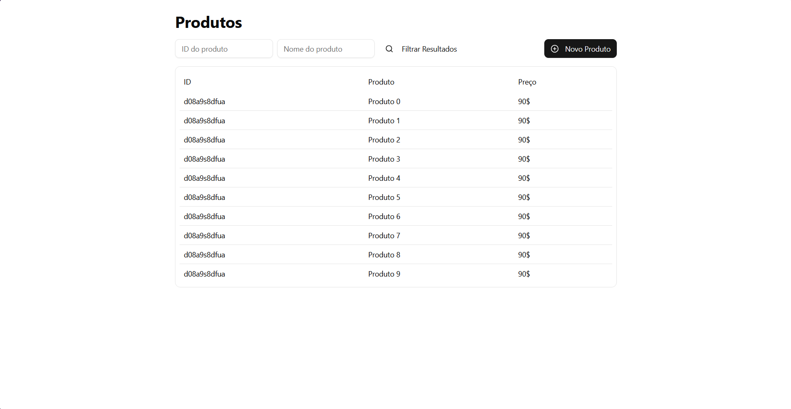

# 🛍️ Product Manager UI

Interface moderna para gestão de produtos, construída com **React**, **Vite** e **TypeScript**, com UI poderosa baseada em **ShadCN UI** e ícones **Lucide**.
Ideal para catálogos, dashboards administrativos ou sistemas de inventário.

---

## 📸 Preview

---

## 🚀 Tecnologias Usadas

- ⚛️ [React](https://react.dev/) – Biblioteca de interfaces reativas
- ⚡ [Vite](https://vitejs.dev/) – Dev server rápido com suporte a TypeScript
- 🔷 [TypeScript](https://www.typescriptlang.org/) – Tipagem estática para JavaScript
- 🎨 [Tailwind CSS](https://tailwindcss.com/) – Estilização moderna baseada em utilitários
- 🧩 [ShadCN UI](https://ui.shadcn.dev/) – Componentes acessíveis e personalizáveis
- 💡 [Lucide React](https://lucide.dev/) – Ícones open-source para React

---

## ✨ Funcionalidades

- 📦 **Listagem de Produtos** com imagem, nome, descrição e preço
- ➕ **Criação de Produto** com formulário dinâmico
- 📝 **Edição e Atualização** de dados do produto
- 🗑️ **Remoção** com confirmação
- 🔍 (Opcional) Filtro por categoria, preço ou nome
- 💅 Interface **responsiva** e com foco em **usabilidade**
